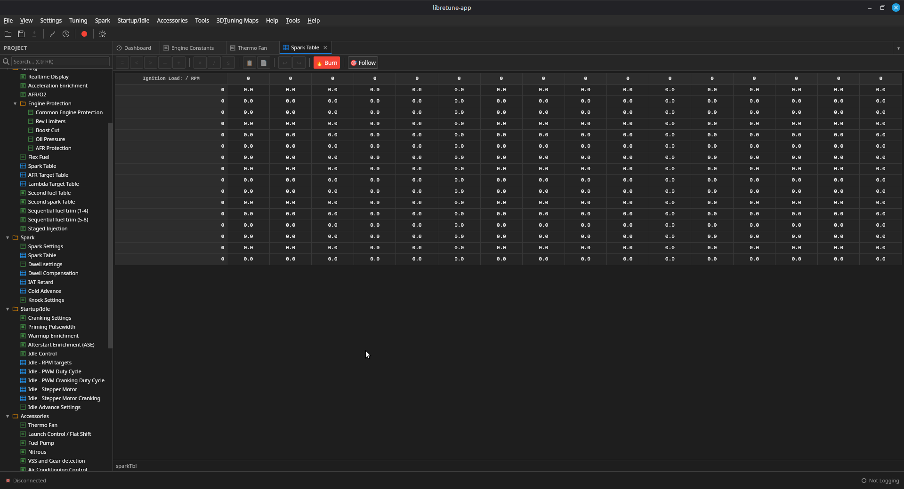
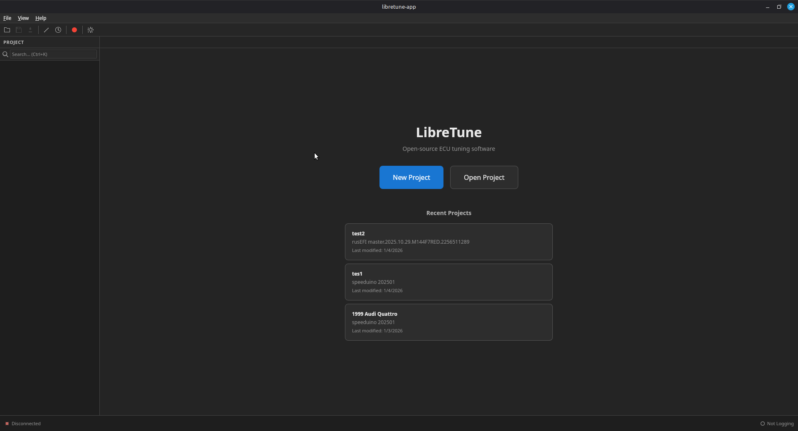
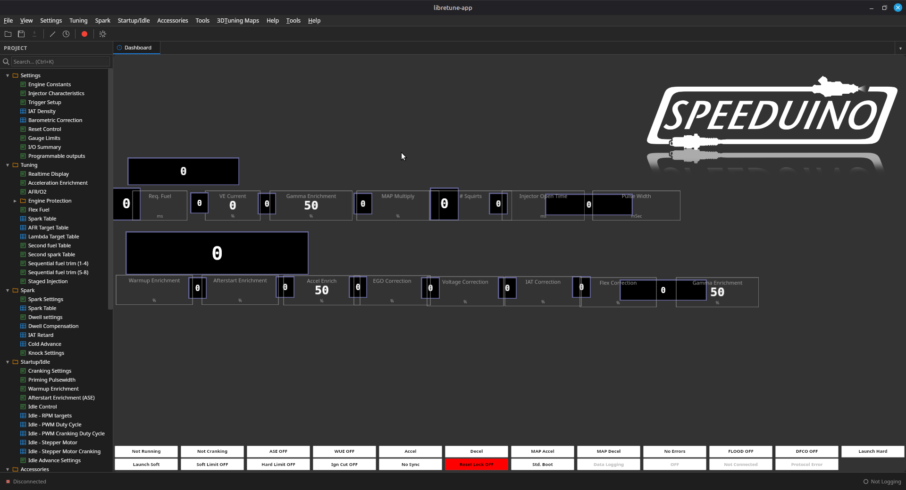

# LibreTune

[](https://www.gnu.org/licenses/old-licenses/gpl-2.0.en.html)
[](https://github.com/RallyPat/LibreTune/actions/workflows/ci.yml)
[](https://github.com/RallyPat/LibreTune/releases/latest)
[](https://github.com/RallyPat/LibreTune/releases/tag/nightly)

[](https://discord.gg/5X7tFUfqCr)

Modern, open-source ECU tuning software for Speeduino, rusEFI, EpicEFI, and other INI-compatible aftermarket engine control units. Built with a Rust core and a native desktop UI via Tauri.

> ⚠️ **Project status — early days.** These notes are largely agentically written and may not be 100% accurate. Public contributions are welcome — see [CONTRIBUTING.md](CONTRIBUTING.md) and the [CHANGELOG](CHANGELOG.md) for what's landed recently.

## Downloads

| Platform | Stable Release | Nightly Build | Notes |
|----------|----------------|---------------|-------|
| **Linux** |  No Stable releases at this time, please use the nightly. | [Nightly](https://github.com/RallyPat/LibreTune/releases/tag/nightly) | AppImage is portable, no install needed |
| **Windows** |  No Stable releases at this time, please use the nightly. | [Portable EXE](https://github.com/RallyPat/LibreTune/releases/tag/nightly) | Nightly is portable, no install needed |
| **macOS** |   No Stable releases at this time, please use the nightly. | [Nightly](https://github.com/RallyPat/LibreTune/releases/tag/nightly) | Separate builds for Apple Silicon and Intel |

> ⚠️ **Nightly builds** are automatically generated from the latest code and may be unstable.



## Features

### Table Editing
Full-featured 2D grid editor with 3D surface visualization, keyboard navigation, and live ECU cursor tracking. Includes Set Equal, Scale, Interpolate, Smooth, Re-bin, Copy/Paste, table comparison, and direct Burn to ECU.

### Dashboards & Gauges
Import existing .dash files or build layouts from scratch with 13 gauge types (analog dials, bar gauges, sweep gauges, digital readouts, line graphs, histograms, tachometers, and more). Drag-and-drop designer mode with three default dashboards included.

### AutoTune
Live fuel table recommendations based on AFR targets with heat map visualization, cell locking, authority limits, transient filtering, and lambda delay compensation.

### Diagnostics & Logging
Data logger with configurable sample rates, playback controls, CSV import/export, math channels, and alert rules. Tooth logger and composite logger for trigger pattern analysis. Text-based ECU console for rusEFI/FOME/epicEFI.

### Data Management
Project-based workflow with restore points, Git-based tune versioning, CSV export/import, TunerStudio project import, INI version tracking with automatic tune migration, and change annotations. Online INI search from Speeduino and rusEFI GitHub repos.

### Additional
- **Multi-monitor**: Pop out any tab to its own window with bidirectional sync
- **Unit preferences**: Temperature (°C/°F/K), pressure (kPa/PSI/bar/inHg), AFR/Lambda
- **Performance calculator**: Estimated HP/torque curves and acceleration times
- **Action scripting**: Record and replay tuning actions across tunes, with INI-backed validation
- **Extensible**: WASM plugin system with sandboxing and permission model
- **Localization**: i18n scaffold with English and Brazilian Portuguese (`pt-BR`); add new locales under `crates/libretune-app/src/i18n/locales/`
- **Demo mode**: Run the app without an ECU using the bundled simulator (Settings → Enable Demo Mode)

For full documentation, see the [User Manual](https://rallypat.github.io/LibreTune/) or the [architecture overview](docs/architecture.md).

## Screenshots

| Welcome Screen | Settings Dialog | Table Editor |
|:--------------:|:---------------:|:------------:|
|  |  |  |

## Supported ECUs

| ECU | INI Support | Serial Protocol |
|-----|:-----------:|:---------------:|
| **Speeduino** | ✅ | ✅ |
| **rusEFI** | ✅ | ✅ |
| **FOME** | ✅ | ✅ |
| **EpicEFI** | ✅ | ✅ |
| **MegaSquirt MS2/MS3** | ✅ | Partial |

Any ECU using the standard INI definition format should be compatible.

## Quick Start

### Prerequisites

- **Rust (stable)** — Install via [rustup](https://rustup.rs)
- **Node.js 20+** — For the Tauri frontend
- **Platform build deps** — see the OS notes below

### Build & Run

```bash
git clone https://github.com/RallyPat/LibreTune.git
cd LibreTune

cd crates/libretune-app
npm install
npm run tauri dev
```

<details>
<summary><strong>Notes for Linux Users</strong></summary>

Tauri 2 needs WebKitGTK and a few system libraries. On Debian/Ubuntu:

```bash
sudo apt install -y libwebkit2gtk-4.1-dev librsvg2-dev libssl-dev \
  build-essential curl wget file libxdo-dev libayatana-appindicator3-dev
```

On Fedora:

```bash
sudo dnf install -y webkit2gtk4.1-devel openssl-devel curl wget file \
  libxdo-devel libappindicator-gtk3-devel librsvg2-devel "@C Development Tools and Libraries"
```

See the [Tauri prerequisites guide](https://v2.tauri.app/start/prerequisites/) for other distros.

</details>

<details>
<summary><strong>Notes for Windows Users</strong></summary>

If `link.exe` is not found, install the Visual Studio Build Tools:

1. Download from [visualstudio.microsoft.com/downloads](https://visualstudio.microsoft.com/downloads/) → "Tools for Visual Studio" → "Build Tools for Visual Studio"
2. During installation, enable **Desktop development with C++**
3. Set the Rust toolchain: `rustup default stable-x86_64-pc-windows-msvc`
4. Restart your terminal, then build as above

</details>

<details>
<summary><strong>Notes for macOS Users</strong></summary>

Install the Xcode command-line tools:

```bash
xcode-select --install
```

WebKit ships with macOS, so no extra system packages are required.

</details>

### Build for Production

```bash
cd crates/libretune-app
npm run tauri build
```

## Project Structure

```
libretune/
├── crates/
│   ├── libretune-core/         # Core Rust library
│   │   └── src/
│   │       ├── ini/            # INI file parsing
│   │       ├── protocol/       # Serial communication
│   │       ├── ecu/            # ECU memory model
│   │       ├── datalog/        # Data logging
│   │       ├── autotune/       # AutoTune algorithms
│   │       ├── tune/           # Tune file management
│   │       ├── dash/           # Dashboard format (incl. layout.rs defaults)
│   │       └── project/        # Project, restore points, Git versioning
│   └── libretune-app/          # Tauri desktop application
│       ├── src/                # React frontend (TypeScript)
│       │   ├── components/     # UI (dialogs, dashboards, gauges, tuner-ui, …)
│       │   ├── contexts/       # Cross-cutting React providers
│       │   ├── hooks/          # Reusable hooks (realtime, ECU events, …)
│       │   ├── i18n/           # Localization (en, pt-BR)
│       │   └── stores/         # State stores
│       └── src-tauri/          # Tauri backend (Rust)
│           └── src/
│               ├── commands/   # Tauri commands (~70 sub-modules)
│               └── state.rs    # Shared AppState
├── docs/                       # User manual (mdBook) + architecture.md
├── scripts/                    # Build and development scripts
├── CHANGELOG.md                # Keep-a-Changelog history
└── Cargo.toml                  # Workspace root
```

For a deeper dive into module boundaries and Phase 1–8 cleanup history, see [docs/architecture.md](docs/architecture.md) and [CHANGELOG.md](CHANGELOG.md).

## Development

See [CONTRIBUTING.md](CONTRIBUTING.md) for development setup and guidelines, and [docs/architecture.md](docs/architecture.md) for a tour of the codebase.

### Tests

```bash
# Rust workspace
cargo test --workspace

# Frontend (vitest)
cd crates/libretune-app && npm run test:run
```

### Lints & type checks

```bash
cargo clippy --workspace --all-targets -- -D warnings
cargo fmt --all -- --check

cd crates/libretune-app
npm run typecheck
```

The full pre-push pipeline (build + tests + clippy + fmt + frontend build/tests) is wrapped in [scripts/pre-push.sh](scripts/pre-push.sh) and runs automatically as a Git hook.

## License

This program is free software; you can redistribute it and/or modify it under
the terms of the GNU General Public License version 2 as published by the Free
Software Foundation.

See [LICENSE](LICENSE) for the full license text.

## Contributing

Contributions are welcome! Please read [CONTRIBUTING.md](CONTRIBUTING.md) before submitting PRs.

## Acknowledgments

LibreTune is an independent open-source project and is not affiliated with EFI Analytics.
